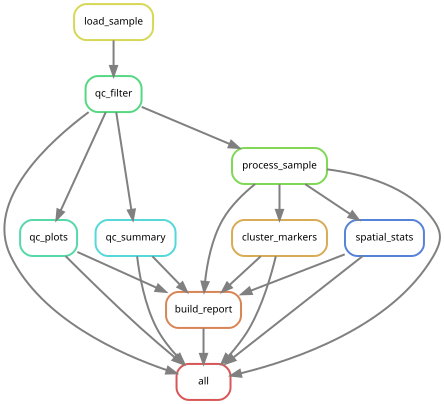

# Spatial Transcriptomics Analysis Pipeline (Xenium + Visium)

[](https://github.com/gynecoloji/snakemake_scstseq/actions/workflows/ci.yml)
[](https://github.com/gynecoloji/snakemake_scstseq/releases/latest)
[](https://snakemake.github.io)
[](https://hub.docker.com/r/gynecoloji/scstseq-pipeline)
[](LICENSE)
<!-- After the first GitHub release with the Zenodo integration enabled, add:
[](https://doi.org/<concept-doi>) -->

A Snakemake workflow for **spatial transcriptomics** that starts from the
vendor output directories of both **single-cell, imaging-based** sections
(10x Genomics **Xenium**) and **spot-level, sequencing-based** sections
(10x Genomics **Visium**), and produces per-section QC with platform-specific
thresholds, normalization / clustering / marker genes, a spatial neighbours
graph with neighborhood enrichment and Moran's I spatially variable genes,
and a self-contained cross-sample HTML report.

The repository mirrors the structure and automation of its siblings
[snakemake_ATACseq_spikein](https://github.com/gynecoloji/snakemake_ATACseq_spikein)
and [snakemake_scRNAseq](https://github.com/gynecoloji/snakemake_scRNAseq):
standard [Snakemake Workflow Catalog](https://snakemake.github.io/snakemake-workflow-catalog/)
layout, schema-validated configuration, per-rule conda environments,
Docker/Apptainer containers, CI with an executable test case that asserts
planted values, and release-please versioning.

## Overview

One `snakemake --use-conda` run builds every stage in dependency order
(unified DAG); each stage is also a target of its own.

| stage | target | per section |
|---|---|---|
| **QC** | `qc_all` | platform reader → per-cell/spot metrics (counts, genes, % mito/ribo/hemoglobin; Xenium: cell/nucleus area, control-feature fraction) → platform thresholds with the **first failing rule recorded as the drop reason** → QC plots → cross-sample summary |
| **Processing** | `process_all` | `normalize_total` + `log1p` → HVGs (Visium; Xenium panels use every gene) → optional scaling → PCA → neighbours → **Leiden** → UMAP → **marker genes** per cluster (dotplot + table) |
| **Spatial** | `spatial_all` | spatial neighbours graph (Xenium: kNN / Delaunay / radius over µm centroids; Visium: hexagonal grid rings) → **neighborhood enrichment** between clusters → **Moran's I** spatially variable genes (permutation p-values, BH-FDR) → top SVGs drawn on the section |
| **Report** | `all` (default) | one self-contained HTML page: summary table + every figure and top table per section, images embedded, no JavaScript |
| **Imputation** | `impute_all` (*opt-in*) | denoise / fill in the dropouts of the measured genes with **MAGIC**, **ALRA** and/or **scVI** (one output set per method, all on the log-normalized scale), per-gene before/after statistics, observed-vs-imputed figures of the top spatially variable genes, and a cross-sample summary |

Everything is Python: [scanpy](https://scanpy.readthedocs.io) for I/O, QC and
clustering, [squidpy](https://squidpy.readthedocs.io) for the spatial
statistics, in one conda environment (`workflow/envs/py-scst.yaml`); the
opt-in scVI imputation has its own environment (`py-scvi.yaml`, or the CUDA
build `py-scvi-gpu.yaml`).

### Imputation (opt-in)

`snakemake --use-conda --cores 8 impute_all` runs every method listed in
`imputation.methods` on every section, after the processing and spatial
stages. All three impute the genes already in the matrix (dropout
denoising); none imputes genes missing from a Xenium panel.

| method | engine | notes |
|---|---|---|
| `magic` | [magic-impute](https://github.com/KrishnaswamyLab/MAGIC) 3.0 (pip-installed by the env's post-deploy script) | diffusion over the expression kNN graph (`knn`, `t`, `n_pca`, `decay`); minutes per section on CPU |
| `alra` | numpy re-implementation of [ALRA](https://github.com/KlugerLab/ALRA) in `workflow/scripts/alra.py` | rank chosen from the singular-value noise floor, per-gene thresholding and rescaling, observed non-zeros restored; no extra dependency |
| `scvi` | [scvi-tools](https://scvi-tools.org) | one model per section on the raw counts, `get_normalized_expression` at a fixed library size then `log1p`; latent space kept in `obsm["X_scVI"]`; CPU env by default, CUDA env via `imputation.scvi.gpu: true` + the GPU container |

`imputation.genes: hvg` (default) imputes the highly variable genes and falls
back to every gene when none were selected (Xenium); `all` imputes every
gene. Outputs land in `results/imputed/` as `{sample}.{method}.h5ad`
(restricted to the imputed genes, observed values in X, imputed values in
`layers["imputed"]`), a per-gene statistics table (zero fraction before and
after, means, observed-vs-imputed correlation), a figure of the top
spatially variable genes observed next to imputed, and
`imputation_summary.tsv` with one row per section and method. Clustering,
markers and the spatial statistics are always computed on the observed
values; treat imputed values as a visualization and smoothing aid.

**Roadmap** (not yet implemented): multi-sample integration, cell-type
annotation (marker scoring / reference mapping), Visium deconvolution,
reference-based imputation of genes outside a Xenium panel, Visium HD (its
positions file is parquet), CosMx / MERSCOPE readers.

## Workflow diagram



Regenerate it from the executable test case with:

```bash
snakemake -s workflow/Snakefile -d .test --forceall --rulegraph | dot -Tsvg > images/rulegraph.svg
```

## Requirements

- [Snakemake](https://snakemake.github.io) ≥ 8.0 with conda/mamba
  (`snakemake-minimal` + `pandas` is enough as the driver), **or** just
  Apptainer/Docker using the provided image (see below).
- The per-rule tool environment (`workflow/envs/py-scst.yaml`: Python 3.12,
  scanpy 1.11, squidpy 1.8, anndata, h5py, pyarrow, leidenalg, igraph,
  matplotlib, seaborn) is created automatically on the first `--use-conda`
  run; its post-deploy script pip-installs `magic-impute` for the opt-in
  imputation (the conda builds of MAGIC's dependency chain are too old to
  solve next to scanpy). The scVI env (`py-scvi.yaml`, PyTorch on CPU) is
  only created when `impute_all` is requested with `scvi` in
  `imputation.methods`.

## Input files

Point each `samples.csv` row at the **vendor output directory**; nothing is
copied or converted beforehand.

| `platform` | files read from `path` | produced by |
|---|---|---|
| `xenium` | `cell_feature_matrix.h5`, `cells.parquet` (or `cells.csv.gz`) | Xenium Onboard Analysis `outs/` |
| `visium` | `filtered_feature_bc_matrix.h5`, `spatial/tissue_positions.csv` (or `tissue_positions_list.csv`), `spatial/scalefactors_json.json`; tissue images used when present | Space Ranger `outs/` |

Xenium control features (negative-control probes/codewords, unassigned and
genomic controls) are counted per cell into `control_frac` and removed from
the gene matrix; Visium spots outside the tissue are dropped at load time.
See [`config/README.md`](config/README.md) for the column reference.

```csv
sample_id,platform,path,condition
xenium_tumor_1,xenium,xenium_tumor_1/outs,tumor
visium_tumor_1,visium,visium_tumor_1/outs,tumor
visium_normal_1,visium,visium_normal_1/outs,normal
```

## Installation

```bash
git clone https://github.com/gynecoloji/snakemake_scstseq.git
cd snakemake_scstseq

# Driver environment (the tool env is created on the first --use-conda run).
# The containers and CI pin snakemake-minimal 9.3.2; any Snakemake >= 8 works.
mamba create -n scstseq -c conda-forge -c bioconda snakemake-minimal=9.3.2 pandas
conda activate scstseq
```

> **No local install?** Use the container image instead — see
> [Container execution](#container-execution-docker--apptainer).

## Configuration

All parameters live in [`config/config.yaml`](config/config.yaml), documented
inline and validated on every run against
[`workflow/schemas/config.schema.yaml`](workflow/schemas/config.schema.yaml)
(the single source of truth: types, defaults, descriptions; the Snakemake
Workflow Catalog renders it as a parameter table). The sections are
per-platform where the platforms differ:

| section | Xenium default | Visium default |
|---|---|---|
| `qc.<platform>` | `min_counts: 10`, `min_genes: 5`, `min_area` / `max_area` / `max_control_frac` off, `min_cells: 5` | `min_counts: 500`, `min_genes: 250`, `max_pct_mt: 30`, `max_pct_hb` off, `min_cells: 10` |
| `processing.<platform>` | `target_sum: 100`, every gene, no scaling, 30 PCs, 15 neighbours, Leiden 0.5 | median target, 2000 `seurat_v3` HVGs, scaling, 30 PCs, 15 neighbours, Leiden 0.5 |
| `spatial.<platform>` | `generic` coordinates, kNN `n_neighs: 10` (or `delaunay` / `radius` in µm) | `grid`, `n_neighs: 6`, `n_rings: 1` |

Every threshold uses `0` = disabled. Shared keys: `genome.*_pattern`
(mito / ribo / hemoglobin gene-name regexes; switch for mouse),
`processing.markers`, `processing.seed`, `spatial.nhood_enrichment.n_perms`,
`spatial.moran.{n_perms,n_top,plot_top}`, `imputation.{methods,genes,magic,alra,scvi}`
(opt-in stage, see above), `report.enabled`, `threads.*`.

## Running the pipeline

The workflow is the standard-layout `workflow/Snakefile`; Snakemake finds it
automatically from the repo root, so `-s workflow/Snakefile` is optional.

### Dry run

```bash
snakemake -s workflow/Snakefile -n            # validates config + builds the DAG
```

### Local execution

```bash
snakemake -s workflow/Snakefile --use-conda --cores 8                # everything (default target)
snakemake -s workflow/Snakefile --use-conda --cores 8 qc_all         # one stage
snakemake -s workflow/Snakefile --use-conda --cores 8 process_all
snakemake -s workflow/Snakefile --use-conda --cores 8 spatial_all
snakemake -s workflow/Snakefile --use-conda --cores 8 impute_all     # opt-in imputation
```

> **Running from a batch script?** Invoke Snakemake by its **absolute path**
> rather than putting the driver environment on `PATH`, so the per-rule
> environment's own Python is the one the scripts run with.

### Cluster execution

For a SLURM cluster, the standard executor plugin works unchanged (not
benchmarked here):

```bash
pip install snakemake-executor-plugin-slurm
snakemake -s workflow/Snakefile --use-conda --executor slurm --jobs 20 \
  --default-resources slurm_partition=<partition> mem_mb=32000 runtime=240
```

Large Xenium sections (hundreds of thousands of cells) are the memory-hungry
case: `spatial_stats` holds the kNN graph and the permutation tests, so give
that rule the most memory and threads (`threads.spatial_stats`).

### Container execution (Docker / Apptainer)

One prebuilt image covers the whole workflow — you install nothing except
Docker or Apptainer:

| image | contents | used for |
|---|---|---|
| **`gynecoloji/scstseq-pipeline`** | Snakemake + the pre-built `py-scst` and `py-scvi` (CPU) conda envs | every stage, including CPU imputation |
| `scstseq-pipeline-gpu.sif` (build from `apptainer-gpu.def`) | the same with the CUDA scVI env | `impute_all` with `imputation.scvi.gpu: true` on a GPU node (`apptainer run --nv …`) |

**Download** — no build required. On HPC (Apptainer / Singularity) a single
command downloads it and writes a ready-to-run `.sif` in your current
directory:

```bash
apptainer pull scstseq-pipeline.sif docker://gynecoloji/scstseq-pipeline:latest   # HPC
docker pull gynecoloji/scstseq-pipeline:latest                                     # Docker
```

The image's entrypoint is
`snakemake --use-conda --conda-frontend mamba --conda-prefix /opt/wf-conda`,
so anything after the image name goes straight to `snakemake`. Data are not
baked in; run from your project directory (which holds `config/` and `data/`).

```bash
# Apptainer (auto-mounts $HOME, /tmp and the current directory; runs as you)
module load apptainer                                   # if your cluster uses modules
apptainer run scstseq-pipeline.sif -s workflow/Snakefile --cores 16
apptainer run scstseq-pipeline.sif -s workflow/Snakefile --cores 16 qc_all
apptainer run scstseq-pipeline.sif -s workflow/Snakefile --cores 1 -n

# Docker
docker run --rm -v "$(pwd)":/workflow -e HOME=/tmp --user "$(id -u):$(id -g)" \
    gynecoloji/scstseq-pipeline:latest -s workflow/Snakefile --cores 16
./run_pipeline.sh --cores 16                            # convenience wrapper (builds locally if needed)
docker compose run --rm scstseq -s workflow/Snakefile --cores 16 qc_all
```

If your vendor directories live outside the project (e.g. on scratch), bind
them in — `--bind /scratch/xenium:/scratch/xenium` — and use absolute paths
in `samples.csv`. Build the image yourself with `docker compose build` or
`apptainer build --fakeroot scstseq-pipeline.sif apptainer.def`; details in
[`DOCKER.md`](DOCKER.md).

## Deploying with snakedeploy

This repository follows the Snakemake Workflow Catalog structure, so it can be
deployed into another project without cloning it by hand:

```bash
pip install snakedeploy
snakedeploy deploy-workflow https://github.com/gynecoloji/snakemake_scstseq . --tag main
```

Then edit the `config/` copy it writes, place your data, and run with
`snakemake --use-conda`.

## Outputs (`results/`)

```
results/
├── raw/{sample}.h5ad                       # loaded section: counts, obsm["spatial"], platform metadata
├── qc/
│   ├── {sample}.filtered.h5ad              # cells/spots + genes that passed QC
│   ├── {sample}_qc_cells.tsv               # per cell: x, y, every metric, qc_keep, qc_drop_reason
│   ├── {sample}_qc_stats.json              # counts before/after, per-reason drops, medians, thresholds
│   ├── plots/{sample}/qc_metrics.png       # metric histograms with threshold lines
│   ├── plots/{sample}/spatial_qc.png       # counts / genes / verdict on the section
│   └── qc_summary_all.{tsv,png}            # one row per section
├── processed/
│   ├── {sample}.h5ad                       # log-normalized X, layers["counts"], X_pca, X_umap, obs["leiden"]
│   ├── {sample}_clusters.tsv               # cell, leiden, UMAP, x, y
│   ├── {sample}_markers.tsv                # top-N markers per cluster (score, log2FC, padj, % expressing)
│   └── plots/{sample}/{umap_clusters,spatial_clusters,markers_dotplot}.png
├── spatial/
│   ├── {sample}.h5ad                       # + obsp["spatial_connectivities"], uns["moranI"], nhood enrichment
│   └── {sample}/{nhood_enrichment.tsv,nhood_enrichment.png,morans_i.tsv,top_svg_spatial.png}
├── report/scstseq_report.html              # self-contained cross-sample report
# ── Imputation (opt-in: `snakemake impute_all`) ──
└── imputed/
    ├── {sample}.{method}.h5ad              # imputed genes only: observed X + layers["imputed"] (scvi: obsm["X_scVI"])
    ├── {sample}.{method}_gene_stats.tsv    # per gene: % zeros before/after, means, observed-vs-imputed r
    ├── {sample}.{method}_run.json          # parameters, runtime, method extras (rank, epochs, ...)
    ├── plots/{sample}.{method}_observed_vs_imputed.png
    └── imputation_summary.tsv              # one row per section x method
```

Logs go to `logs/<rule>/<sample>.log`.

### Directory structure

```
snakemake_scstseq/                     # Snakemake Workflow Catalog layout
├── config/                            # config.yaml, samples.csv, README.md
├── workflow/
│   ├── Snakefile                      # entry point (unified DAG; targets: qc_all, process_all, spatial_all)
│   ├── rules/                         # common.smk, qc.smk, process.smk, spatial.smk, report.smk, impute.smk
│   ├── scripts/                       # one Python script per rule + scst_common.py / scst_impute.py / alra.py helpers
│   ├── envs/                          # py-scst.yaml (everything), py-scvi.yaml + py-scvi-gpu.yaml (scVI imputation)
│   └── schemas/config.schema.yaml     # parameter definitions (single source of truth)
├── .test/                             # executable test case (synthetic Xenium + Visium sections)
├── tests/                             # unit tests (pytest)
├── .snakemake-workflow-catalog.yml    # catalog metadata (enables snakedeploy)
├── Dockerfile, docker-compose.yml, apptainer.def, apptainer-gpu.def, run_pipeline.sh, create_envs.smk, DOCKER.md
├── data/                              # vendor output directories (you provide)
├── results/, logs/                    # outputs
└── images/rulegraph.svg
```

## Tests & CI

- **Unit tests** (`pytest tests/ -q`): schema validity and shipped configs,
  sample-sheet checks, the QC threshold logic (drop-reason precedence,
  `0` = off), both platform readers on in-memory vendor directories, the
  ALRA implementation on a planted low-rank matrix with dropouts, and the
  imputation helpers. They need only anndata / numpy / pandas / scipy / h5py
  / pyyaml / jsonschema.
- **Executable test case** ([`.test/`](.test)): a deterministic generator
  plants the truth — two spatial domains with disjoint marker programs, a
  known number of low-quality cells and high-mito spots — for one Xenium and
  two Visium sections, and `assert_outputs.py` asserts the **values** that
  come out (exact kept counts and drop reasons, domain-pure Leiden clusters,
  domain markers first in Moran's I, self-enriched neighborhoods, and for
  every imputation method a lower zero fraction of the domain markers with
  their domain separation and observed-vs-imputed correlation preserved).

  ```bash
  python .test/make_testdata.py
  snakemake -s workflow/Snakefile -d .test --sdm conda --cores 2 all impute_all
  python .test/assert_outputs.py
  ```
- **CI** (`.github/workflows/ci.yml`): a `static` job (snakefmt, pytest, dry
  runs of every target over stubbed inputs, lint) and an `integration` job
  that runs the executable test case end to end with a cached conda env and
  gates on the assertions.

## Versioning & releases

Commits follow [Conventional Commits](https://www.conventionalcommits.org);
[release-please](https://github.com/googleapis/release-please) turns them
into a release PR that bumps `version.txt`, `CITATION.cff` and
`CHANGELOG.md`, and tags a GitHub Release on merge. See
[`CONTRIBUTING.md`](CONTRIBUTING.md).

## Troubleshooting

- **Every cell/spot dropped** — `qc_filter` stops with the thresholds it
  used; relax `qc.<platform>` (`0` disables a rule). Xenium counts are
  transcripts per cell (tens to hundreds), Visium counts are UMIs per spot
  (thousands); do not reuse one platform's thresholds for the other.
- **Missing input file at DAG build** — the loader lists the exact vendor
  files it needs as rule inputs; the error names the missing path. Check
  `platform` and `path` in `samples.csv`.
- **One Leiden cluster** — markers and neighborhood enrichment need ≥ 2; raise
  `processing.<platform>.resolution`. Tiny pilot sections are handled (PCs
  and neighbours are capped to the data size).
- **Slow `spatial_stats` on large Xenium sections** — lower
  `spatial.moran.n_perms` (`0` keeps the analytic p-values only) and
  `spatial.nhood_enrichment.n_perms`, or restrict Moran's I to HVGs by
  enabling `processing.xenium.hvg`.
- **Imputation memory** — the imputed matrix is dense (cells × imputed
  genes, float32). A 500k-cell Xenium section with a 5k panel needs ~10 GB
  per method; use `imputation.genes: hvg` with `processing.xenium.hvg: true`
  to limit the genes, and give `threads.impute` the memory-rich node. scVI
  on CPU is slow for large sections; use the GPU container.

## Citation

If you use this workflow in your research, please cite it via the
**"Cite this repository"** button on GitHub (generated from
[`CITATION.cff`](CITATION.cff)).

**Please also cite the tools it builds on:**
- **Snakemake**: Mölder, F. et al. (2021). Sustainable data analysis with Snakemake. F1000Research, 10, 33.
- **scanpy**: Wolf, F.A., Angerer, P. and Theis, F.J. (2018). SCANPY: large-scale single-cell gene expression data analysis. Genome Biology, 19, 15.
- **squidpy**: Palla, G. et al. (2022). Squidpy: a scalable framework for spatial omics analysis. Nature Methods, 19, 171–178.
- **Leiden**: Traag, V.A., Waltman, L. and van Eck, N.J. (2019). From Louvain to Leiden: guaranteeing well-connected communities. Scientific Reports, 9, 5233.
- **UMAP**: McInnes, L., Healy, J. and Melville, J. (2018). UMAP: Uniform Manifold Approximation and Projection for dimension reduction. arXiv:1802.03426.
- **anndata**: Virshup, I. et al. (2024). anndata: Access and store annotated data matrices. Journal of Open Source Software, 9(101), 4371.
- **MAGIC** (if `imputation.methods` includes `magic`): van Dijk, D. et al. (2018). Recovering gene interactions from single-cell data using data diffusion. Cell, 174(3), 716–729.
- **ALRA** (if `alra`): Linderman, G.C. et al. (2022). Zero-preserving imputation of single-cell RNA-seq data. Nature Communications, 13, 192.
- **scVI** (if `scvi`): Lopez, R. et al. (2018). Deep generative modeling for single-cell transcriptomics. Nature Methods, 15, 1053–1058.

## License

This project is licensed under the MIT License — see the [LICENSE](LICENSE) file.

## Contact

**Author**: gynecoloji
**Project repository**: [https://github.com/gynecoloji/snakemake_scstseq](https://github.com/gynecoloji/snakemake_scstseq)

For questions, issues, or feature requests, please check the existing
[Issues](https://github.com/gynecoloji/snakemake_scstseq/issues), then open a
new one with the exact `snakemake` command, the platform, and the relevant
`logs/` file.
